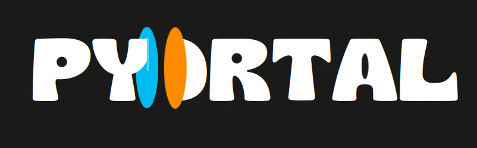

# PyOrtal - Ray Casting with Python and Portal




https://github.com/user-attachments/assets/52e2b193-b5b4-4d5e-bdc4-a2dafbf39e59


## How to run

1. Clone the repository:
```bash
git clone git@github.com:Fer14/pyortal.git
cd pyortal
```

2. Install dependencies:
```bash
pip install -r requirements.txt
```

3. Run the game:
```bash
python app.py --mode 3
```

Replace 3 with 2 for 2D mode.


https://github.com/user-attachments/assets/33ddb2ec-e688-4a29-a00e-c5ae0f598944


##  How to Play

- Movement: Use the arrow keys to move around.
- Jumping: Press the space bar to jump.
- Shooting Portals:
    - Press A to shoot a blue portal.
    - Press D to shoot an orange portal.
- Menu: Press Q to open the in-game menu.

##  Game Modes

- `--mode 3`: Play in 3D mode.
- `--mode 2`: Play in 2D mode.

Menu Settings

- Field of View (FOV): Adjust the FOV for a customized perspective.
- Portal Images: Toggle whether portal images are displayed.


## Acknowledgments

Original inspiration from [https://github.com/Magoninho/raycasting-python](Magoninho/raycasting-python).

Built with Pygame for game development and Typer for CLI options.
 
